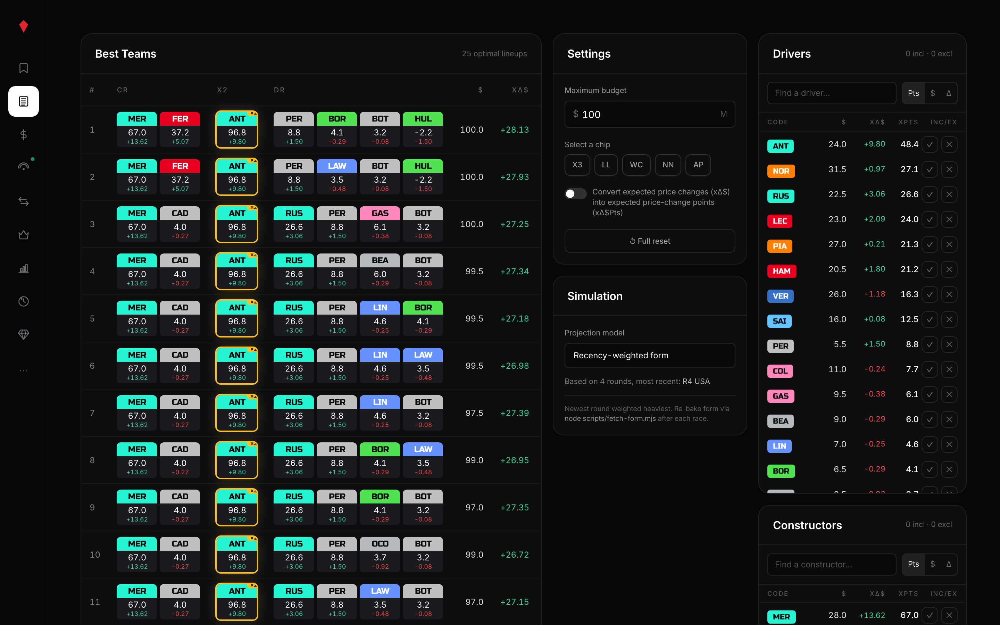

# F1 Fantasy Lab


A no-login fantasy F1 optimizer and analysis tool. Build a 5-driver, 2-constructor squad
under a $100M cap, let the optimizer enumerate the best possible lineups, score your team
against the most recent race, and dig into value, transfers, price moves, and hindsight.
All projections are computed in the browser from real race results.



## Features

Nine tools, all driven off the same projection model:

- **Pick Team (Builder).** Manual squad construction with sortable columns (name, team,
  price, projected points, points-per-million, trend), a live budget bar, and one driver
  set as the DRS Boost captain.
- **Best Teams (Optimizer).** Enumerates driver and constructor combinations under the cap
  and returns the top 25 lineups by projected points. Lock or exclude specific assets,
  adjust the budget, and toggle fantasy chips (triple captain, limitless, wildcard,
  no-negatives, autopilot).
- **Race Score.** Your current lineup's actual points from the most recent completed race,
  broken down per driver (base + captain multiplier) and per constructor.
- **Transfers.** Single-asset swaps that improve projected points while respecting the
  remaining budget, each showing the cost delta and the projected-points delta.
- **Statistics (Value Board).** A sortable table of every driver and constructor across
  eight columns including points-per-million (value) and a form trend.
- **Hindsight.** For each completed round, the mathematically best lineup that existed that
  day using actual results, with budget adjustments to see depth.
- **Price Moves.** Predicts who is likely to rise or fall next round using a 3-race
  rolling-average model with asymmetric thresholds.
- **Consensus Picks.** Runs the optimizer under ~22 constraint variants and tallies which
  assets (and captains) show up most often.
- **Saved Teams.** Browser-local storage of up to 12 lineups for side-by-side comparison.

## How it works

**Projection model (`app/lib/form.ts`).** Each asset's projected points come from a
recency-weighted mean of its history (linear ramp, newest race weighted highest), an OLS
slope for the form trend, and derived value metrics (points-per-million).

**Optimizer (`app/lib/optimizer.ts`).** A full enumeration with budget pruning rather than
a heuristic solver. It generates driver and constructor combinations under the cap, picks
the optimal captain inside each lineup (the driver whose weighted projection times the
boost multiplier gains the most), and keeps the top 25 via a min-heap. It runs in roughly
100ms on a laptop.

**Data pipeline (`scripts/fetch-form.mjs`).** Pulls 2026 season qualifying, race, and sprint
results from the Jolpica/Ergast API and bakes them into `public/form.json`. The app reads
that static file; no live calls at runtime. Scoring rules (per-position points, bonuses,
penalties) live in `app/lib/scoring.ts`.

**Persisted state (`app/lib/persisted.ts`).** A `usePersisted` hook built on
`useSyncExternalStore` keeps your lineup in `localStorage`, stays SSR-safe (no hydration
mismatch), and syncs across browser tabs via `StorageEvent`.

## Tech stack

- **Next.js 16 (App Router) + React 19 + TypeScript**
- **Tailwind CSS v4**
- **Jolpica / Ergast API** for season results (baked at build time)
- No charting library and no state-management library: plain React hooks plus a
  `localStorage`-backed store

## Run it

```bash
npm install
node scripts/fetch-form.mjs    # bake public/form.json from the Ergast mirror (optional; a copy is committed)
npm run build && npm start     # open http://localhost:3000
```

> This project uses a customized Next.js whose dev server (`npm run dev`) has a broken
> hot-reload socket. Use `npm run build && npm start` to run it.

## Project layout

```
app/
  page.tsx                 # loads form.json, renders the Shell
  components/
    Shell.tsx              # sidebar nav + active tool, holds the persisted lineup
    Builder.tsx            # manual squad picker
    Optimizer.tsx          # top-25 lineups + chips/locks/budget
    ValueBoard.tsx         # sortable stats table
    LastRaceScore.tsx      # actual score from the last race
    Transfers.tsx          # single-swap suggestions
    Hindsight.tsx          # best-possible lineup per past round
    PriceTrends.tsx        # next-round price-move predictions
    PopularPicks.tsx       # consensus across optimizer variants
    Compare.tsx            # saved-lineup storage and comparison
  lib/
    data.ts                # 2026 grid: drivers, constructors, prices
    scoring.ts             # fantasy scoring rules
    form.ts                # projection model (weighted mean, trend, value)
    optimizer.ts           # enumerating optimizer + hindsight
    persisted.ts           # localStorage hook via useSyncExternalStore
scripts/
  fetch-form.mjs           # bakes public/form.json from Jolpica/Ergast
```

## Notes

- Driver and constructor prices in `app/lib/data.ts` are placeholders; verify against the
  official game before relying on absolute value numbers. The projection and optimization
  logic is independent of those exact figures.
- Driver-of-the-day points are not exposed by Ergast and are scored as absent.
